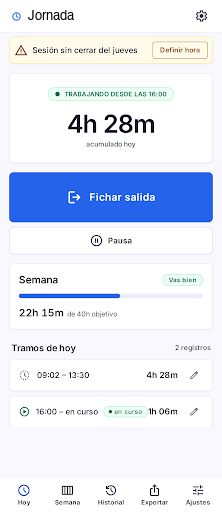
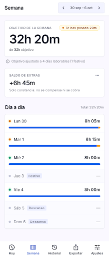
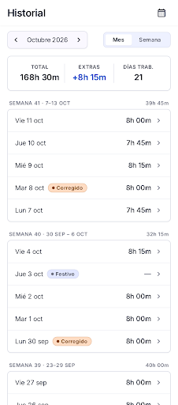
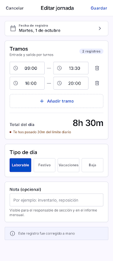
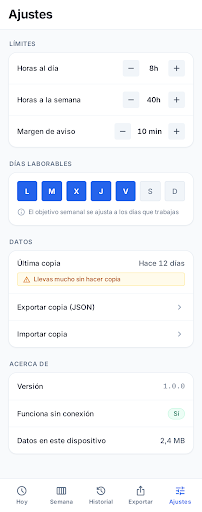
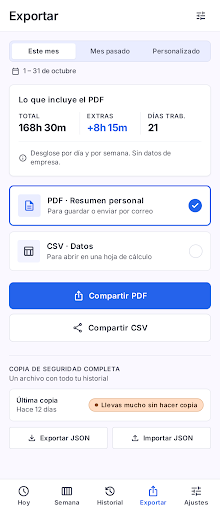

<div align="center">

# Fichaje Ferretería

**PWA personal para controlar tus horas de trabajo. 8 h al día y 40 h a la semana, ni más ni menos.**

Sin cuentas, sin nube, sin backend. Todo el historial vive en tu dispositivo.

[](https://fichaje-ferreteria.vercel.app)
[](https://github.com/moisesvalero/fichaje-ferreteria/actions/workflows/ci.yml)
[](LICENSE)
[](src/lib)
[](https://svelte.dev)
[](tsconfig.json)
[](https://vite.dev)
[](vite.config.ts)
[](#rendimiento)
[](#privacidad)
[](DESIGN.md)

</div>

---

## El problema

Empecé a trabajar en una ferretería y quería controlar que hacía mis **8 h al día y 40 h a la semana, ni más ni menos**. No para reclamar nada, solo para saber cuánto hacía de más y tener constancia.

Lo que había no servía: las apps de fichaje o son de empresa (con cuenta y jefe) o son hojas de cálculo que abandonas a la semana. Así que decidí construirme una, con tres condiciones: **que funcione sin conexión, que los datos no salgan de mi móvil y que los límites sean configurables**.

## Las pantallas

Diseñadas en **Google Stitch** y aprobadas antes de escribir una línea de código. `DESIGN.md` es la especificación vinculante.

<table>
  <tr>
    <td align="center" width="33%"><br><b>Hoy</b><br><sub>Fichar con un botón grande, contador en vivo y estado de la semana</sub></td>
    <td align="center" width="33%"><br><b>Semana</b><br><sub>Objetivo ajustado, extras y saldo acumulado</sub></td>
    <td align="center" width="33%"><br><b>Historial</b><br><sub>Por mes y por semana, con lo corregido marcado</sub></td>
  </tr>
  <tr>
    <td align="center"><br><b>Editar jornada</b><br><sub>Corregir tramos a mano, tipo de día y nota</sub></td>
    <td align="center"><br><b>Ajustes</b><br><sub>Todos los límites configurables</sub></td>
    <td align="center"><br><b>Exportar</b><br><sub>PDF, CSV y copia de seguridad JSON</sub></td>
  </tr>
</table>

## Funcionalidad

- **Fichar entrada y salida** con un botón de 88 px, pensado para pulsarlo de pie y con prisa.
- **Jornada partida**: cada día son tramos (mañana y tarde); el parón de comer no computa.
- **Corregir a mano** cualquier día: añadir o quitar tramos, marcar festivo, vacaciones o baja, y poner una nota. Lo tocado a mano queda marcado como corregido.
- **Olvidos**: si te vas sin fichar la salida, esa sesión no computa y la app te pide que definas la hora. **Nunca inventa horas.**
- **Semana**: objetivo ajustado a los días que de verdad trabajas, horas de más y **saldo acumulado de extras** (solo constancia: no se compensa ni se cobra).
- **Aviso** cuando te pasas, con margen de tolerancia configurable, siempre dentro de la app.
- **Exportar** a **PDF** (resumen personal) y **CSV**, y **copia de seguridad** completa en JSON, exportable e importable.

## Las reglas del cálculo

El motor vive en [`src/lib/calculo.ts`](src/lib/calculo.ts): es puro, no toca ni el reloj ni la base de datos, y la interfaz y las exportaciones lo consumen en lugar de reimplementarlo. Estas son las reglas, y cada una tiene su test:

| Regla                                                                          | Por qué                                                                      |
| ------------------------------------------------------------------------------ | ---------------------------------------------------------------------------- |
| Los tramos se **fusionan** antes de sumar                                      | Dos tramos solapados cuentan una vez: el reloj no trabaja dos veces a la vez |
| **Una sola regla de redondeo**: cada intervalo fusionado al minuto, y se suman | La app, el PDF y el CSV dan exactamente la misma cifra. Antes no             |
| Un tramo abierto de un día anterior es un **olvido** y no computa              | No puede contar como si siguieras trabajando desde ayer                      |
| El **extra es semanal**, no diario                                             | Si un día haces 9 h y otro 7 h, la semana cuadra                             |
| El **objetivo semanal se prorratea** a los días computables                    | Un festivo lo baja a 32 h; si no, la app diría que vas −8 h                  |
| El **saldo firme** solo suma semanas cerradas                                  | Mientras la semana está en curso, lo de más todavía puede cuadrar            |
| El aviso usa **margen de tolerancia**; el saldo es exacto                      | No salta por salir a las 17:02, pero el número es verdad                     |

> **Sobre `horas/día` y `horas/semana`.** Son dos ajustes que pueden contradecirse (6 h × 5 días = 30 h, no 40). En lugar de elegir por ti, la app usa `horas/semana` para el objetivo semanal y `horas/día` para el diario, y **te avisa en Ajustes si los dos no cuadran**.

## Arquitectura

```
src/
├── lib/
│   ├── calculo.ts          Motor de horas: reglas, fusión de solapes y saldo (puro)
│   ├── tipos.ts            Modelo de dominio: Jornada, Tramo, Ajustes, Estado
│   ├── fechas.ts           Aritmética de fechas locales, inmune al cambio de hora
│   ├── parseo.ts           Validación de fechas y horas: o son correctas, o null
│   ├── formato.ts          Cifras y fechas en español, con cifras tabulares
│   ├── db.ts               Persistencia en IndexedDB (Dexie), saneado y transacciones
│   ├── estado.svelte.ts    Estado global, cola de escritura y reloj en vivo
│   ├── exportar.ts         CSV, resumen para PDF, copia JSON y validación profunda
│   └── estados.ts          Copy de interfaz para los estados
├── pantallas/              Hoy, Semana, Historial, Editor, Ajustes, Exportar
├── app.css                 Tokens de DESIGN.md y primitivas visuales
└── App.svelte              Shell con la barra de pestañas
```

**Sin router** (cinco pestañas no lo justifican), **sin Tailwind** (seis pantallas con una jerarquía muy marcada) y **sin backend**, que es justamente el punto.

## Stack

| Pieza                              | Por qué                                                                                                                             |
| ---------------------------------- | ----------------------------------------------------------------------------------------------------------------------------------- |
| **Svelte 5 + Vite**                | Arranque de 59 kB gzip y reactividad sin ceremonia. Descarté SvelteKit y Next: sin backend ni SEO, el SSR solo añade piezas móviles |
| **TypeScript en `strict`**         | Con `noUncheckedIndexedAccess` y `noUnusedLocals`, que ya han cazado fallos reales                                                  |
| **Dexie (IndexedDB)**              | `localStorage` es síncrono, tiene 5 MB y se pierde antes                                                                            |
| **vite-plugin-pwa**                | Precache completo: la app abre sin conexión, fuentes incluidas                                                                      |
| **jsPDF con importación dinámica** | Arrastra `html2canvas` y `dompurify` (200 kB): no deben cargarse para ver un reloj                                                  |
| **Vitest + fake-indexeddb**        | Probar el motor puro está bien, pero los bugs de verdad estaban en la cola de escritura y en la validación del JSON                 |

## Calidad

| Comprobación         | Resultado                                       |
| -------------------- | ----------------------------------------------- |
| Tests                | **112** en 4 ficheros                           |
| `pnpm check`         | 0 errores, 0 avisos                             |
| `pnpm lint` (oxlint) | 0 avisos                                        |
| `pnpm build`         | OK, service worker con 18 recursos precacheados |
| `pnpm audit --prod`  | Sin vulnerabilidades conocidas                  |

### Lo que encontró la auditoría

El proyecto pasó por una **revisión adversarial** antes de publicarse, y la primera pasada lo **rechazó** con tres fallos críticos y doce importantes. Los tres críticos eran reales y están arreglados con su test de regresión:

1. **El importador de copias no validaba.** Aceptaba `2026-02-31` (formato correcto, día inexistente), y ese dato dejaba la pantalla Semana rota **en cada arranque, sin forma de recuperarla desde la interfaz**. Ahora se valida la existencia real de la fecha, la coherencia de cada tramo y los ajustes campo a campo; la restauración va en una transacción con vuelta atrás; al arrancar se sanean y borran los registros dañados.
2. **Los ajustes importados entraban con un cast.** Un `diasLaborables: null` tumbaba la app entera. Ahora, si no encajan, se conservan los del usuario y se avisa.
3. **La doble pulsación en «Fichar entrada».** El botón más usado y el más pulsado con prisa. Se arregló **serializando** las escrituras en una cola en lugar de descartar la segunda pulsación, porque descartarla perdía una pausa inmediata y el reloj seguía corriendo.

Además: los tramos solapados contaban doble, el CSV y el PDF podían discrepar en un minuto, `horas/semana` no lo usaba nadie (el control no hacía nada) y una hora inválida en el editor se convertía en un tramo abierto en silencio.

**Dos de los tests de regresión están verificados desactivando el arreglo**: fallan sin él. Un test que no puede fallar no vale nada.

Una **segunda pasada** encontró un crítico más de la misma familia y tres importantes, ya corregidos: un backup con dos tramos que compartieran identificador hacía que Svelte lanzara al renderizar y dejaba la app sin arrancar (los ids repetidos se renombran); un `inicio: 0` de 1970 entraba sin una queja y sumaba 29 millones de minutos al saldo (los instantes se acotan al día de su jornada y a 24 h de duración); la importación anunciaba «Copia restaurada» a la vez que mostraba el fallo de la transacción; y cambiar el límite semanal reescribía hacia atrás el saldo ya apuntado, cosa que ahora no ocurre porque **el objetivo de cada semana se congela al cerrarse**.

## Accesibilidad y PWA en iOS

**Accesibilidad**

- Todo el texto cumple **WCAG AA** (4,5:1) y los elementos gráficos que informan, 3:1. Las pestañas inactivas estaban en 2,56:1 y se corrigieron.
- El **zoom no está bloqueado** (WCAG 1.4.4).
- Los estados **nunca se comunican solo con color**: cada chip y cada punto lleva su texto o su etiqueta accesible.
- El diálogo del editor recibe el foco al abrirse, lo **atrapa** mientras está abierto y lo devuelve al cerrarse.

**Instalada en iOS**

- `standalone` con `viewport-fit=cover` y área segura respetada arriba y abajo.
- **Sin rebote blanco** al tirar hacia abajo, sin destello al pulsar y sin retardo de doble toque.
- **Pantallas de arranque para siete tamaños de iPhone**: iOS no las genera desde el manifest, así que sin ellas aparece un blanco al abrir. Se generan desde el mismo SVG del icono.
- Iconos: **180** (iOS), **192** y **512**, más una variante **`maskable`** con el fondo a sangre para que ningún recorte deje un borde raro.
- La actualización del service worker **no recarga la app sola**: avisa dentro y actualizas cuando te venga bien. Con recarga automática se podía perder una corrección a medias en el editor.

## Rendimiento

| Métrica             | Valor                                    |
| ------------------- | ---------------------------------------- |
| JS de arranque      | **59 kB gzip**                           |
| jsPDF + html2canvas | Diferidos: solo se descargan al exportar |
| Fuentes             | Inter autoalojada, subconjunto latino    |

El bundle principal bajó de 191 kB a 59 kB gzip al pasar jsPDF a importación dinámica: no tiene sentido cargar un generador de PDF para mirar un reloj.

## Desarrollo

```bash
pnpm install
pnpm dev            # servidor local
pnpm test           # tests del motor, la exportación y el estado
pnpm check          # tipos y diagnóstico de Svelte
pnpm lint           # oxlint
pnpm build          # build de producción con service worker
pnpm verificar      # lint + check + test + build, todo de una vez
```

## Despliegue

**En vivo: <https://fichaje-ferreteria.vercel.app>**

Desplegado en **Vercel** con `vercel.json` (framework Vite, salida en `dist` y cabeceras de caché para el service worker). Cada push a `main` despliega solo. Al ser una app estática sin backend, cualquier hosting sirve.

Para instalarla en el móvil: abre la URL en el navegador y usa «Añadir a pantalla de inicio». A partir de ahí funciona sin conexión.

## Privacidad

Todo se guarda en IndexedDB, en el dispositivo. **No hay servidor, ni cuentas, ni analítica, ni una sola llamada de red en tiempo de ejecución** (`fetch`, `XMLHttpRequest`, `localStorage` y cookies: cero). La app pide almacenamiento persistente al navegador para que no borre el historial por falta de espacio, pero la única garantía real es la copia de seguridad: hazla de vez en cuando desde Exportar.

## Documentación

- [`DESIGN.md`](DESIGN.md) — el sistema de diseño vinculante, aprobado en Stitch
- [`docs/decisiones.md`](docs/decisiones.md) — las 13 decisiones que se cerraron antes de programar, con su porqué
- [`docs/design/`](docs/design) — las pantallas aprobadas y el manifiesto del proyecto de Stitch

## Licencia

[MIT](LICENSE) © Moisés Valero
